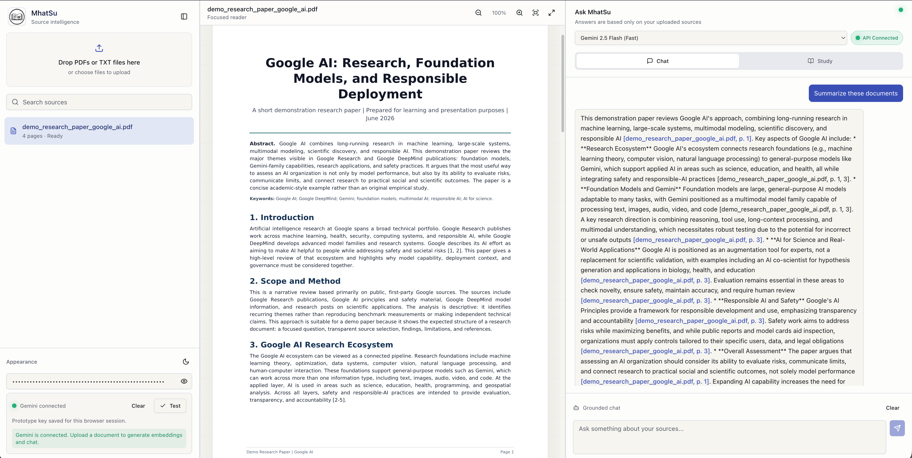
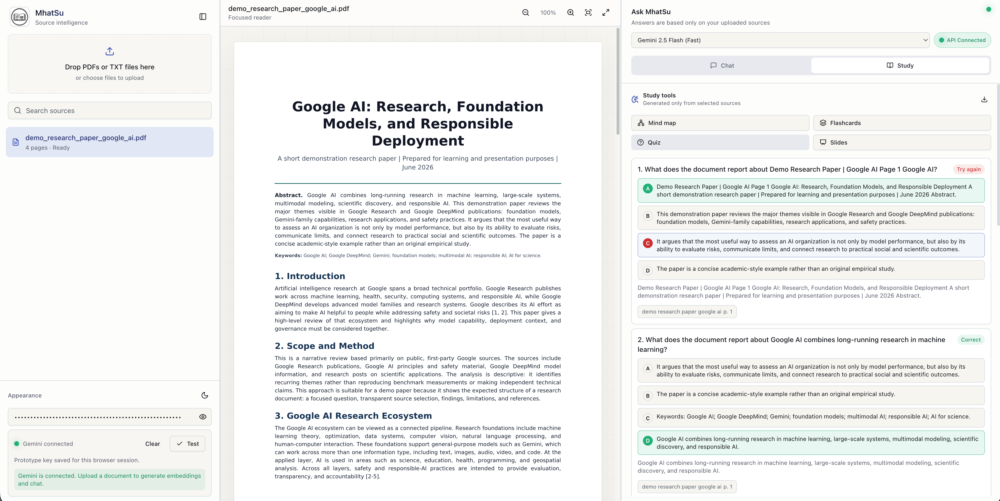
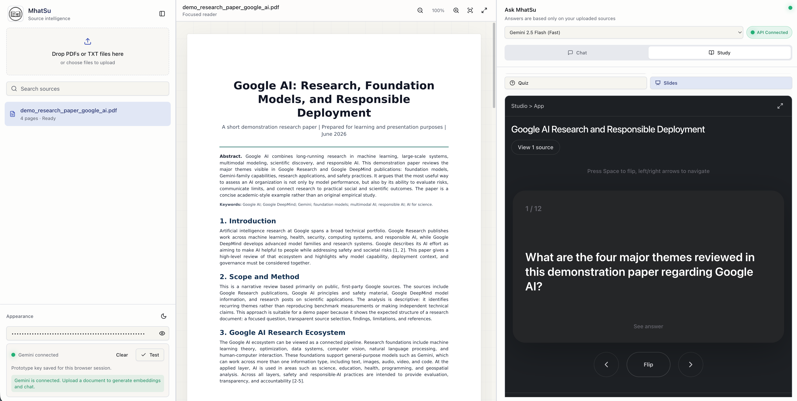
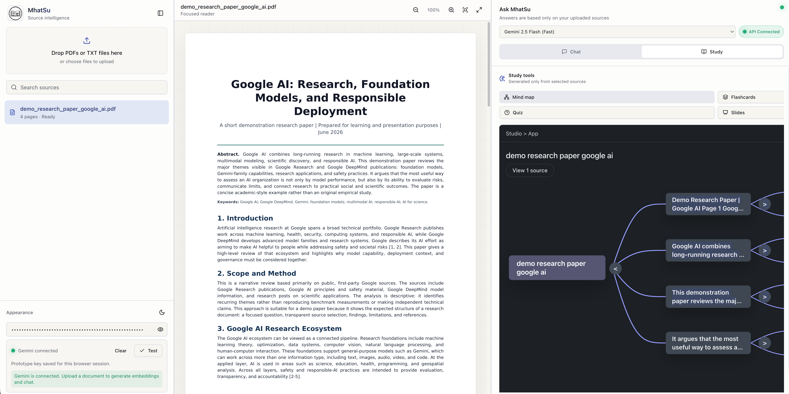

# HmatSu

HmatSu is an AI-powered research and document assistant that turns uploaded PDFs or text files into a grounded study workspace. It combines a focused document reader, source-cited chat, and Gemini-powered study tools so users can understand long documents faster without losing track of evidence.

Built for the Google Build with AI workshop submission, HmatSu focuses on one practical workflow: upload a source, ask questions, verify citations, and generate learning artifacts such as mind maps, flashcards, quizzes, and slide outlines.

## Demo Highlights



## What HmatSu Does

- Upload PDFs or TXT files and extract page-level text.
- Read documents inside a focused PDF viewer with zoom, fullscreen, and page navigation.
- Ask grounded questions using Gemini, with answers based only on retrieved source chunks.
- Show clickable citations that jump back to the matching document page.
- Generate study artifacts from uploaded sources:
  - Mind maps for concept relationships
  - Flashcards for active recall
  - Quizzes for self-testing
  - Slide outlines for presentation preparation
- Support light and dark mode with a responsive three-panel interface.
- Run immediately in prototype mode with a user-provided Gemini API key.
- Optionally persist embeddings with Supabase pgvector for production-style retrieval.

## Study Tools

### Quiz

HmatSu generates multiple-choice questions from selected source chunks and marks correct answers with source references.



### Flashcards

Flashcards help turn dense research material into active recall prompts with source chips.



### Mind Map

The mind map view organizes important ideas and relationships from the document into an interactive visual structure.



### Slides

The slides tool creates a presentation-ready outline from the uploaded source material, helping users move from reading to explaining.

## AI Workflow

1. The user uploads a PDF or TXT file.
2. HmatSu extracts text page by page with PDF.js.
3. The app chunks the extracted text and stores document metadata:
   - `documentId`
   - `documentName`
   - `pageNumber`
   - `chunkIndex`
   - `text`
   - `embedding`
4. Gemini embeddings are created for document chunks and user questions.
5. HmatSu retrieves the most relevant chunks with cosine similarity.
6. Gemini 2.5 generates answers or study artifacts using only retrieved excerpts.
7. The UI verifies citations against chunk metadata before making them clickable.

If no relevant source is found, the assistant replies:

```text
I could not find a confirmed answer in your uploaded sources.
```

## Judging Criteria Fit

### Functionality & Accuracy

HmatSu is source-grounded by design. Chat answers and study artifacts are generated from retrieved document chunks, and citations are tied back to page-level metadata so users can verify claims.

### Innovation & User Experience

The app is not only a chatbot. It turns one uploaded document into multiple learning and research modes: cited chat, reader, mind map, flashcards, quiz, and slides. The interface is designed as a practical research desk rather than a landing page.

### Technical Implementation

HmatSu uses a full Next.js application architecture with API routes, PDF processing, embeddings, retrieval, structured Gemini outputs, optional Supabase pgvector persistence, dark mode, responsive layouts, and Vercel-ready deployment.

## Tech Stack

- Next.js App Router
- TypeScript
- Tailwind CSS
- shadcn-style UI primitives
- Lucide icons
- React PDF and PDF.js
- Gemini 2.5 Flash / Gemini 2.5 Pro / Gemini 2.5 Flash-Lite
- Gemini embeddings
- Supabase pgvector support
- Vercel deployment

## Architecture

- `app/page.tsx`: full-screen workspace, uploads, PDF reader, chat, study tools, citations, dark mode, and responsive mobile tabs.
- `app/api/process`: extracts PDF text page by page with PDF.js.
- `app/api/embeddings`: creates Gemini embeddings for chunks and questions.
- `app/api/chat`: generates grounded Gemini answers from retrieved excerpts.
- `app/api/study`: generates mind maps, flashcards, quizzes, and slide outlines from selected source chunks.
- `app/api/supabase/upsert`: stores chunk vectors in Supabase pgvector when configured.
- `lib/rag.ts`: chunking, cosine similarity, retrieval, excerpt creation, and fallback handling.

## Local Setup

```bash
npm install
cp .env.example .env.local
npm run dev
```

Open `http://localhost:3000`.

For prototype mode, paste a Gemini API key into the sidebar and click **Test**. The key is kept in `sessionStorage` for the current browser session so refreshes do not disconnect the notebook. It is sent to server routes in an HTTPS request header and is not stored in localStorage, cookies, URLs, or logs.

For production mode, set this in `.env.local` or Vercel:

```bash
GEMINI_API_KEY=your_server_side_key
```

Optional Supabase persistence:

```bash
NEXT_PUBLIC_SUPABASE_URL=...
SUPABASE_SERVICE_ROLE_KEY=...
```

Run `supabase/schema.sql` in Supabase SQL Editor to create the `hmatsu_chunks` pgvector table and match function.

## Vercel Deployment

See [VERCEL_DEPLOYMENT.md](VERCEL_DEPLOYMENT.md) for the full step-by-step deployment checklist.

Quick settings:

- Framework Preset: `Next.js`
- Install Command: `npm install`
- Build Command: `npm run build`
- Output Directory: leave empty / Next.js default
- Production environment variable: `GEMINI_API_KEY`
- Optional environment variables: `NEXT_PUBLIC_SUPABASE_URL`, `SUPABASE_SERVICE_ROLE_KEY`

The app uses standard Next.js API routes and is Vercel-ready without custom server configuration.

## Prototype API Key Security

Prototype mode exists so a user can test HmatSu without provisioning server secrets. It has limitations:

- The key is entered in the browser UI.
- The key remains only in browser `sessionStorage` for the current session.
- The key is sent to Next.js API routes in a request header.
- The key is never intentionally logged, persisted, or placed in URLs.

For real deployments, use server-side `GEMINI_API_KEY` and avoid user-entered keys unless you intentionally support bring-your-own-key workflows.
